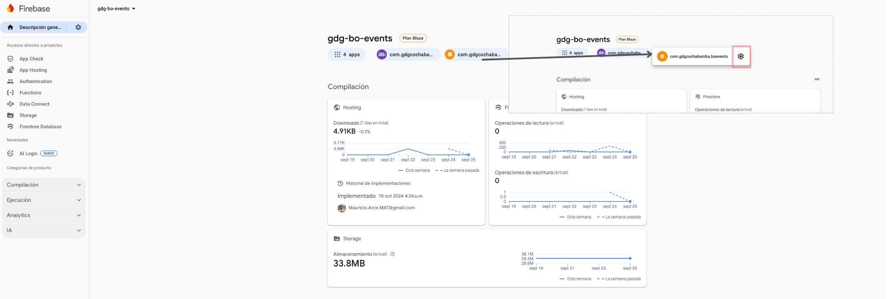
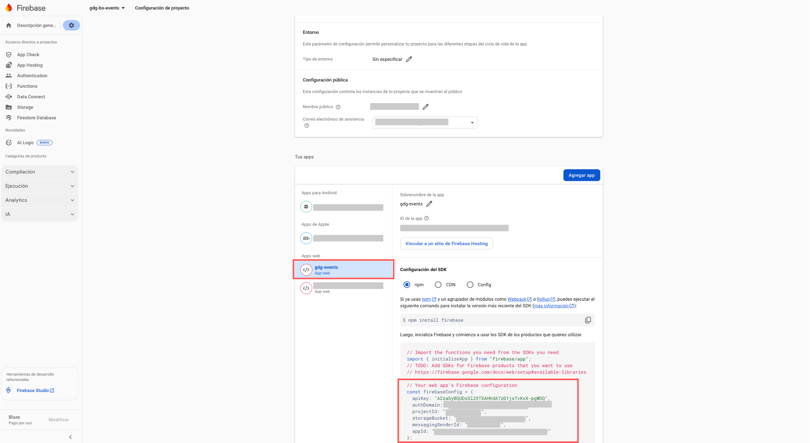

# CombiEvents

CombiEvents is an application for event management.

## 👤 Normal User Role

- View the list of existing events ordered by date.  
- Access an event and see its details, including:  
  - Title  
  - Description  
  - Event location  
  - Cost (if any)  
  - An embedded map  
  - A button to register as a participant  
- The user must log in to register for an event.  
- Once logged in, the user can register for the event.  
- If the event has an associated form or required questions to collect additional information, the user must complete this form first.  
- After completing the form, a summary of the user's responses will be displayed.  
- In this section, if the user has a discount coupon, they can enter it.  
- If no coupon is available, the user can proceed to payment.  
- Different payment methods are available: payment gateway or QR code.  
- Once the payment is completed, the user will be registered and redirected to the event details.  
- If the event has a shop with available products, the user can purchase these products.  
- On the same screen, the user's event ticket will be displayed once the payment is confirmed.  

## 👤 Administrator User Role

- To become an administrator, a user must first be added to the event's administrators list. This action is performed directly in the database by the application administrator.  
- An administrator can view all events ordered by date but can only manage events where they are assigned as an administrator.  
- An administrator can view the list of all users registered for an event, filter them, review each user's information, and validate their payments.  
- An administrator can export the registration list in CSV format.  
- If the event has a product shop, the administrator can review the list of product orders.  
- The administrator can review the list of users registered for workshops if the event has workshop sessions.  
- An administrator can scan tickets on the day of the event.  
- They can also scan tickets for workshops if the event includes workshop sessions.  

## ⚙️ Steps to Run the Project Locally

1. **Clone the project:**  
```bash
git clone https://github.com/combimauri/combi-events
cd combi-events
```

2. **Install Node.js version 20.18.3 or higher** (LTS version recommended):  
[Download Node.js](https://nodejs.org/en/download)

3. **Install project dependencies:**  
```bash
npm ci
```

4. **Create the Firebase keys file:**  
```bash
npm run keys:create
```
This will generate a file `keys.ts` in `./src/environments/keys.ts`, which will store the Firebase keys needed for the project.

5. **Configure Firebase keys:**  
- Access the Firebase console (check your email for the invitation).  
- Open the project `gdg-bo-events`.  
- On the main screen, you will see the project is available for two applications: **mobile** and **web**. Click the **web** icon.  
- Click the **settings** icon. At the bottom of the page, find the web application `gdg-events`.  
- Copy the credentials shown and paste them into the `keys.ts` file.  




6. **Start the project:**  
```bash
npm start
```

7. **Open your browser:**  
Go to [http://localhost:4200/](http://localhost:4200/) to see the project running.